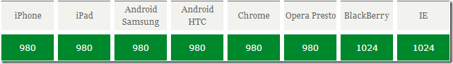

# 移动端布局

## 页面结构布局

* 百分比布局
* 弹性盒布局
* 分栏布局
* 响应式布局
>移动端布局多为多种布局结合使用，达到完美适配的效果

## 单位

* px
* 百分比
* em
相对单位，基于自身字体大小font-size来计算，所以不同的元素1em代表的具体大小可能不同（部分浏览器默认字体是16px）。
* rem
相对单位，可理解为 **root em**, 相对根节点html的字体大小来计算，CSS3新加属性，chrome/firefox/IE9+支持
* vw
viewport width，视窗宽度，1vw等于视窗宽度的1%
* vh
viewport height，视窗高度，1vh等于视窗高度的1%。

>使用vw/vh，需设置meta缩放比1:1
IE9+局部支持，chrome/firefox/safari/opera支持，ios safari 8+支持，android browser4.4+支持，chrome for android39支持


## viewport视口
>移动设备上的viewport就是设备的屏幕上能用来显示我们的网页的那一块区域

各大手机的viewport大小


* 布局视口（layout viewport）
以屏幕分辨率为基准，实际上布局视口的宽度要比屏幕宽出很多，以上图片显示的尺寸就是 layout viewport

* 视觉视口（visual viewport）
layout viewport 的宽度是大于浏览器可视区域的宽度的，所以我们还需要一个viewport来代表 浏览器可视区域的大小，这个viewport叫做**visual viewport**。在js中可以通过window.innerWidth来获取

* 理想视口（ideal viewport）
>一个能完美适配移动设备的视口，需要手动添加meta标签，一般视口大小都设置为设备大小

```
<meta name="viewport" content="width=device-width">
```

* meta标签属性

> 利用以下属性对viewport进行控制, 可多个同时使用，并用逗号隔开
    - width 设置layout viewport  的宽度，为一个正整数，或字符串"device-width"
    - initial-scale 设置页面的初始缩放值，为一个数字，可以带小数
    - minimum-scale 允许用户的最小缩放值，为一个数字，可以带小数
    - maximum-scale 允许用户的最大缩放值，为一个数字，可以带小数
    - user-scalable 是否允许用户进行缩放
        - no代表不允许
        - yes代表允许

### 动态设置字体大小及viewport

```js
<script type="text/javascript">
    // 把尺寸放大N倍（N是window.devicePixelRatio）
    //物理像素*设备像素比=真实像素
    var wd = document.documentElement.clientWidth*window.devicePixelRatio/10;
    document.getElementsByTagName("html")[0].style.fontSize = wd + "px";
    
    // 把屏幕的倍率缩小到N分之一（N是window.devicePixelRatio）
    var scale = 1/window.devicePixelRatio;
    var mstr = 'initial-scale='+ scale +', maximum-scale='+ scale +', minimum-scale='+ scale +', user-scalable=no';
    document.getElementById("vp").content = mstr;
</script>
```